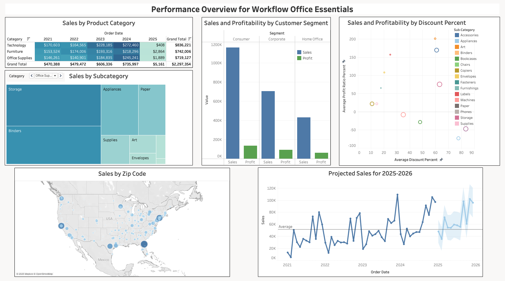
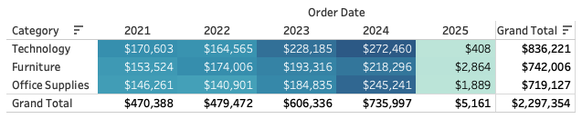
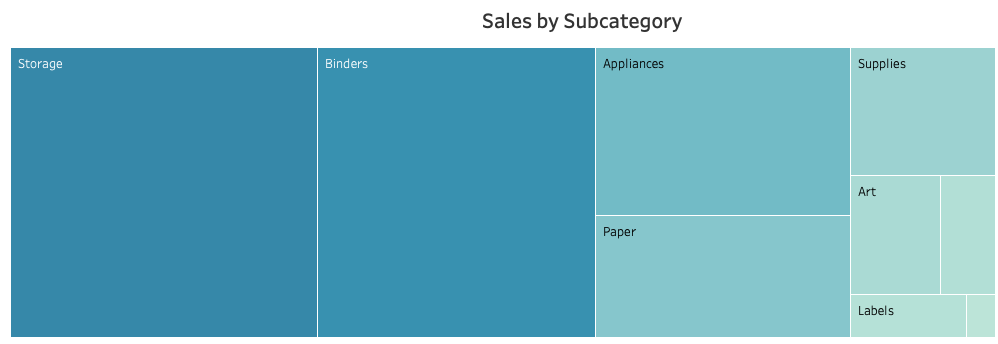
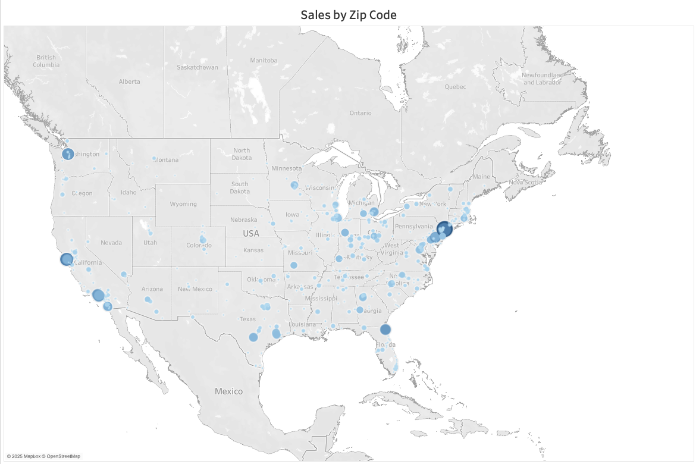
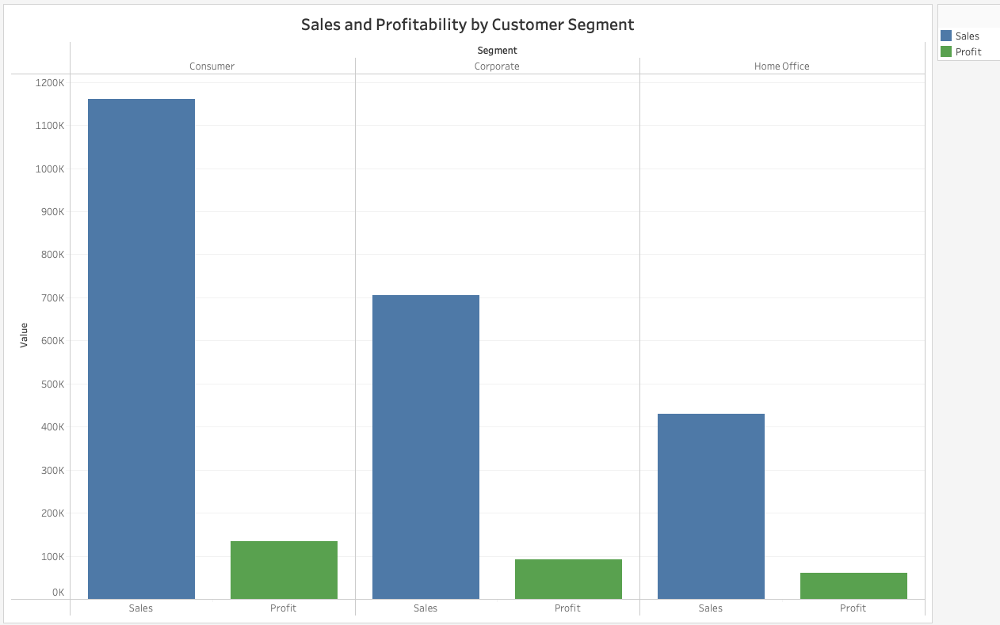
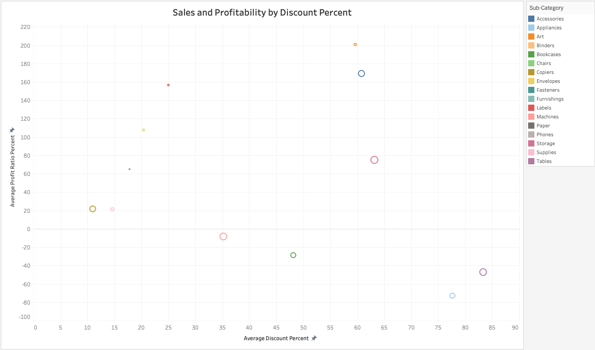
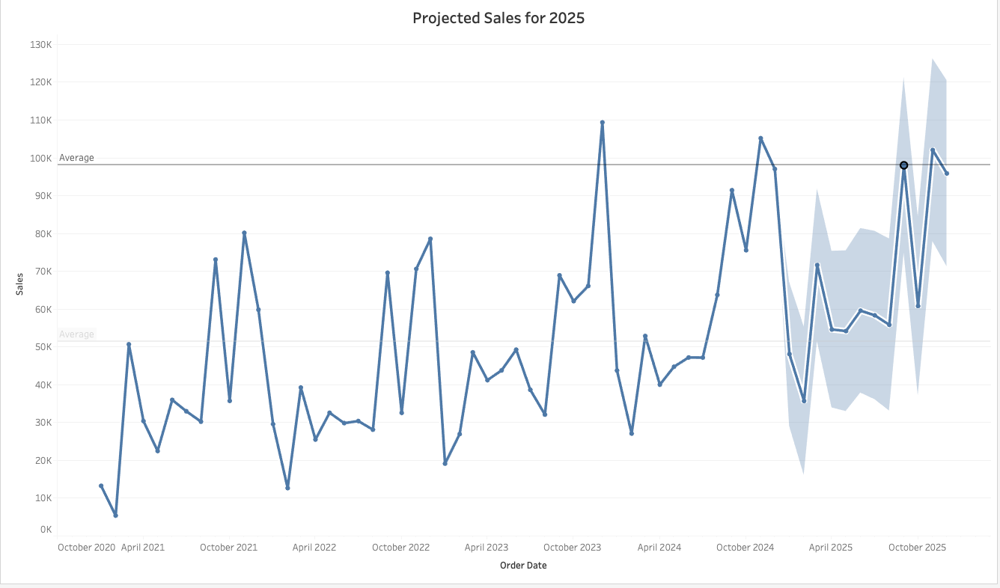

# Sales Performance Analysis and Visualization in Tableau

## Performance Overview Analysis for Workflow Office Essentials (2021-2025)
This project presents a comprehensive analysis of sales and profitability performance for Workflow Office Essentials, a leading office supply store. Leveraging historical transactional data from 2021 to early 2025, this analysis aimed to provide actionable insights into key business drivers, identify trends, and pinpoint areas for strategic improvement.

### Data Description & Methodology
The data consisted of 9,994 transactions ranging from January 2021 to March 2025. Within the dataset, variables were available describing the high-level product category (furntiture, office supplies, and technology), sub-category product descriptions (e.g., chairs, paper, phones), order date, customer segment (consumer, corporate, and home office), customer address, sales amount for each product, the discount applied to the product, and the profit generated from each product. Prior to the analysis, the sales and profit variables, which were initially stored as objects (string) due to the presence of currency symbols ('$') and percentage signs ('%'), were cleaned by removing these characters and converted to a float (numeric) data type to enable accurate calculations and aggregations in Tableau. The order date variable was parsed into its correct data type. 

Visualization & Dashboarding (Tableau): Developing a suite of interactive and intuitive visualizations using Tableau. This involved creating:
Sales & Profit Trend Analysis: Dual-axis line charts to visualize performance over time and identify seasonality.
Product Performance Breakdown: Stacked bar charts and treemaps to assess sales and profit by product category and sub-category, highlighting top performers and underperformers.
Geographic Sales Overview: Dynamic maps displaying sales and profit by region, state, and zip code to identify market hotspots and areas for expansion or intervention.
Customer Segment Insights: Bar charts to compare the contribution of Consumer, Corporate, and Home Office segments to overall sales and profitability.
Profitability Analysis: Scatter plots to evaluate the relationship between sales, profit ratio, and discount, uncovering potentially unprofitable product lines.

### Key Findings:

The interactive Tableau dashboard developed for this project reveals several critical insights into Workflow Office Essentials' operational health and market dynamics:

Overall Sales & Profit Trends:

Analysis of Sales and Profit over the period from 2021 to early 2025 demonstrates a generally consistent upward trend in sales, indicating healthy growth. As an example, sales increased by 56% from 2021 to 2024. A deep dive into product categories highlights that sales were primarily driven by technology products ($836,221), followed by furniture ($742,006) and office supplies ($719,127). The top five product subcategories with the most sales were chairs ($328,454), phones ($330,047), storage ($223,862), tables ($207,968), and binders ($203,428). These results suggest a need for re-evaluation of pricing, inventory, or promotional strategies for these items.

Geographic Sales Distribution:

The Sales by Zip Code map reveals distinct geographic hotspots, with the largest sales coming from major cities including New York City, Philadelphia, Washington D.C., Seattle, San Francisco, Los Angeles, San Diego, and Jacksonville. Although the largest sales came from coastal states, sales were represented across nearly all states in the U.S., with particular representation being high in Michigan, Indiana, Ohio, Georgia, and Texas. Conversely, certain areas, such as the Northwest, Southwest, and Northeast showed lower sales penetration, presenting potential opportunities for targeted marketing campaigns or new market expansion.

Customer Segment Contributions:

Analysis of customer segments (Consumer, Corporate, Home Office) indicates that the individual consumer segment accounts for the largest share of overall sales and profitability. Across all transactions, this segment accounted for $1.16 million in sales and $134,113 in profits. These totals were nearly double that of cthe orporate and home office segments. Understanding these differences is crucial for tailoring marketing messages and optimizing customer relationship management efforts.

Discount Impact on Profitability:

The correlation between Discount and Profit Ratio was explored, revealing a non-associative relationship, which suggests that increasing or decreasing discount rates were not related to profits. With that noted, there were four product subcategories where providing a discount led to lost profits: machines (profit ratio: -8.2), bookcases (profit ratio: -28.9), machines (profit ratio: -47.2), and appliances (profit ratio: -73.0). This underscores the importance of a balanced discounting strategy to protect profitability. As an aside, the three subcategories with the highest profit ratios included labels (profit ratio: 156.7), accessories (profit ratio: 169.1), and art (profit ratio: 200.7).

Project Sales for 2025:

Trend analysis data suggest sales growth for 2025 based on four years of transactional data. Specifically, a slow first quarter of 2025 is predicted, with sales bottoming out in January and February, while sales will remain stagnant in the second quarter. Greater sales are predicted in the third and fourth quarters, with peaks observed during the start of school in September and in the months of November and December, which coincide with Christmas shopping. 

Conclusions & Recommendations:

### Recommendations:

This performance overview for Workflow Office Essentials provides a robust framework for data-driven decision-making. Based on the analysis, the following recommendations are suggested:

Optimize Product Portfolio: Focus on bolstering inventory and marketing for high-performing categories. Investigate and strategize solutions for underperforming categories to improve profitability or consider rationalizing offerings.

Targeted Geographic Expansion/Marketing: Leverage the sales hotspot insights to concentrate marketing efforts in high-potential zip codes and develop strategies to increase market penetration in underserved areas.

Refine Customer Engagement: Tailor sales and marketing initiatives to the unique needs and profitability profiles of the Consumer, Corporate, and Home Office segments.

Strategic Discounting: Implement a more disciplined discounting policy, especially for products where high discounts are consistently eroding profit margins. Consider alternative promotional strategies that drive volume without sacrificing profitability.

Continuous Monitoring: The interactive dashboard serves as a vital tool for ongoing performance monitoring, allowing the Workflow Office Essentials team to track KPIs, identify new trends, and react swiftly to market changes.

## Author
Joseph A. Rios, PhD

Senior Data Scientist

Website: [https://josephriosphd.carrd.co/]

LinkedIn: [www.linkedin.com/in/josephriosphd]

GitHub: [https://github.com/JosephRiosPhD]
